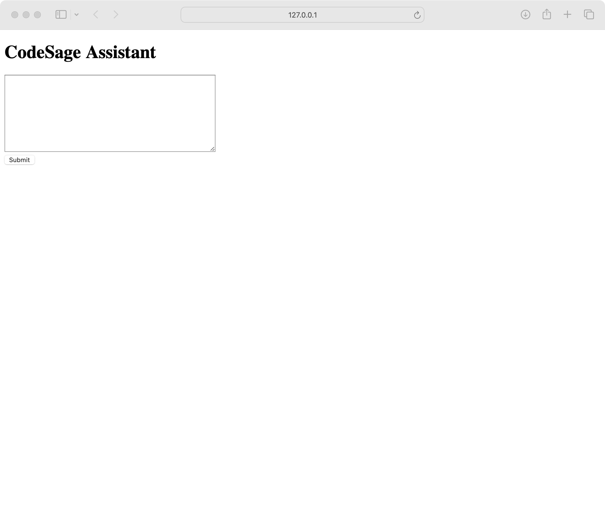
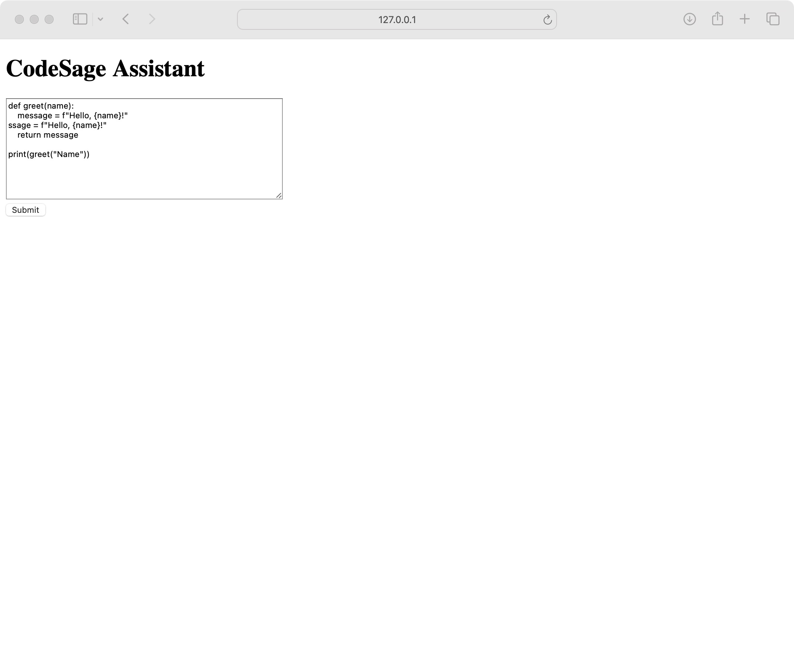
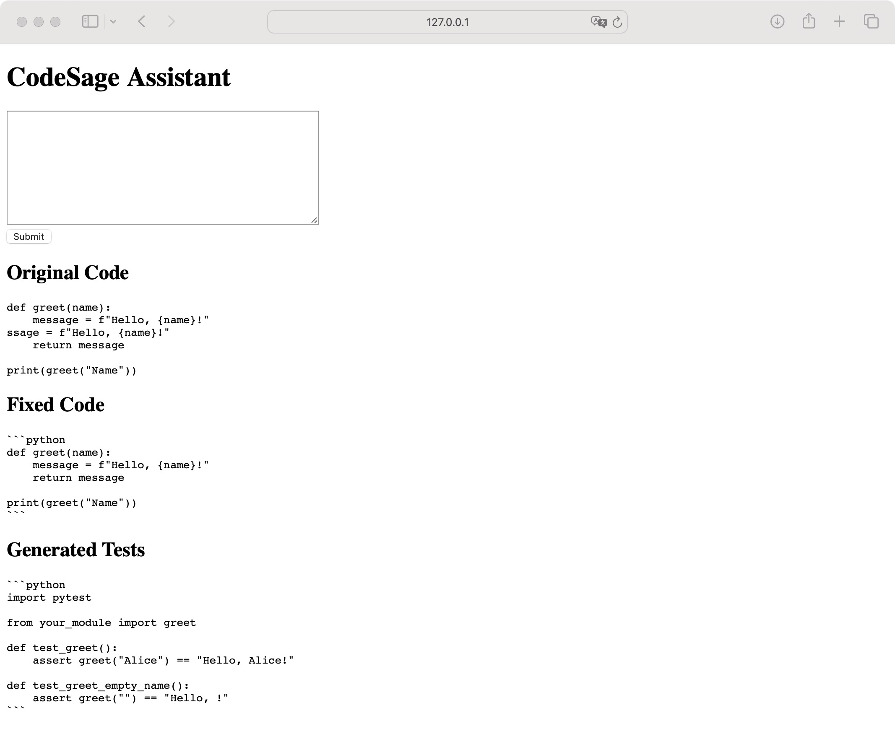

# CodeSage Assistant 🧠💡

**CodeSage** is an intelligent assistant for Python developers. It uses OpenAI GPT models to help you:
- ✅ Automatically **fix broken code**
- 🧪 Generate **pytest-style unit tests**
- 🧠 (Optional) Provide **function analysis summaries**

---

## 📸 Demo Screenshots

| Input | Processing | Output |
|-------|------------|--------|
|  |  |  |

---

## 🚀 Features

- **Fixer**: Auto-corrects broken Python functions using GPT.
- **Tester**: Generates `pytest`-ready unit tests based on your code.
- **Analyzer (optional)**: Describes functions and their purpose (disabled by default).

---

## 🛠️ How to Run Locally

1. Clone the repository:
   ```bash
   git clone https://github.com/Gordon019/CodeSage.git
   cd CodeSage
   ```

2. Install dependencies:
   ```bash
   pip install -r requirements.txt
   ```

3. Add your OpenAI API Key in a `.env` file:
   ```env
   OPENAI_API_KEY=sk-xxxxxxxxxxxxxxxxxxxxxxxxxxxx
   ```

4. Run the Flask app:
   ```bash
   python main.py
   ```

5. Open [http://127.0.0.1:5000](http://127.0.0.1:5000) in your browser.

---

## 📂 Project Structure

```
CodeSage/
├── app/
│   ├── logic/
│   │   ├── fixer.py       # Uses GPT to fix code
│   │   ├── tester.py      # Uses GPT to generate tests
│   │   └── analyzer.py    # (Optional) code structure analysis
│   └── routes.py          # Flask routing
├── templates/
│   └── index.html         # Web UI
├── .env.example           # Sample config
├── .gitignore
├── main.py
└── README.md
```

---

## ✅ Example Output

```python
# Fixed Code
def greet(name):
    message = f"Hello, {name}!"
    return message

# Generated Tests
def test_greet():
    assert greet("Alice") == "Hello, Alice!"
```

---

## 📜 License

MIT License © 2025 Gordon Gao
